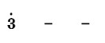

# NotationParser

A tool to convert digital musical notation to pwm rate and duration. You can use this tool to make the buzzer play nice music.

## TODO

- [x] Rate control
  - [x] Pitch
  - [x] Semitone
  - [x] Octave
  - [x] Pause
  - [x] Key Signature
  - [x] Pre-raised
- [ ] Time control
  - [x] BPM
  - [x] Time Signature
  - [x] Note
  - [ ] Mordent
  - [ ] Tie

## Sample code



``` python
parser = NotationParser()

parser.setKeySignature('C')
parser.setPreRaised(0)
parser.setBPM(120)
parser.setTimeSignature(4)

print(parser.parseNotation('+3..'))
```

## Use

### Init

``` python
parser = NotationParser()
```

### Set key signature

Set key signature like `1=C`.

``` python
parser.setKeySignature('C')
```

### Set pre-raised scale

The frequency division capability of the PWM pins of some chips is limited. In order to make the played music still conform to the law, the octave can be raised or lowered uniformly.

``` python
parser.setPreRaised(0)
```

### Set BPM

``` python
parser.setBPM(120)
```

### Set time signature

Set time signature like `4/4`.

``` python
parser.setTimeSignature(4)
```

### Get pwm rate and duration

``` python
parser.parseNotation('+3..')
```

## Notation

For detailed symbols, refer to the following.

### Key Signature

* `C`
* `#C`
* `bD`
* `D`
* `#D`
* `bE`
* `E`
* `F`
* `#F`
* `bG`
* `G`
* `#G`
* `bA`
* `A`
* `#A`
* `bB`
* `B`

### Pitch

* `1`
* `2`
* `3`
* `4`
* `5`
* `6`
* `7`

### Semitone

* `b`: Flat

### Octave

* `+`: Raise one octave
* `-`: Drop one octave

### Pause

* `0`

### Note

* `_`: Eighth note, sixteenth note, thirty-second note. (depending on the number of `_`)
* `.`: Half note, whole note. (depending on the number of `_`)
* `*`: Dotted.

## Special thanks to `延夏新东方演奏群`

* Clavy
* 大酱dz
* 番茄沙司
* 年轻的八云紫
* 小黑鱼
* 原Via
* 宴月